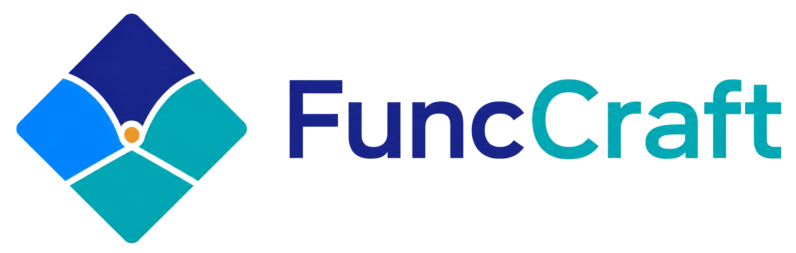

<p align="center">
  
</p>

# FuncCraft

[](https://github.com/khoirulmuzakka/FuncCraft/actions/workflows/ci.yml)
[](https://funccraft.readthedocs.io/)
[](https://pypi.org/project/funccraft/)
[](https://pypi.org/project/funccraft/)
[](https://pypi.org/project/funccraft/)

FuncCraft is a C++17 library with a Python interface for generating scalable
black-box optimization benchmark suites. It builds benchmark functions from
editable YAML specifications, packaged suite collections, primitive benchmark
functions, coordinate transforms, value transforms, and composition rules.

The two central runtime objects are:

- `BenchmarkSuite`: a materialized collection of benchmark functions for one
  chosen dimension.
- `BenchmarkFunction`: one concrete benchmark function that evaluates batches
  of points.

## Why FuncCraft?

Common black-box optimization benchmark suites are intentionally finite. For
example, CEC2017 has 30 functions, CEC2020 has 10, CEC2022 has 12, and
BBOB/COCO 2009 has 24. They also target fixed dimension sets, such as
10/30/50/100 for CEC2017, 5/10/15/20 for CEC2020, and 2/5/10/20/40 for
BBOB/COCO 2009. These suites are useful standards, but they limit how many
distinct landscapes and dimensions can be used in large-scale experiments.

Many traditional benchmarks also rely mainly on shifting and rotation.
FuncCraft generalizes that idea by combining 34 primitive base functions with
a wider set of coordinate transformations, value transformations, composition
functions, and optional nested composed functions. This makes the number of
possible benchmark-function combinations practically unlimited.

FuncCraft is designed to:

- generate practically unlimited benchmark functions at any dimension;
- define reproducible benchmark suites by editing YAML files;
- define reproducible custom benchmark functions with YAML;
- preserve useful function identity under dimension changes;
- improve cross-platform robustness for generated suites;
- expose the same suite-generation model from C++ and Python.

## Mechanism Summary

FuncCraft builds functions from primitive benchmark landscapes, coordinate
transforms, value transforms, and composition rules:

```text
f(x) = assigned_fopt + scale_factor * psi(x, z_1(x), ..., z_m(x))
```

Implemented mechanism families include:

- 34 primitive base functions, including Sphere, Rosenbrock, Ackley,
  Rastrigin, Griewank, Schwefel, Katsuura, Levy, BentCigar, HappyCat,
  HGBat, and StyblinskiTang.
- coordinate transforms: `none`, `rotation`, `affine`, `block-rotation`.
- value transforms: `none`, `power`, `oscillatory`, `cosine-zero`.
- compositions: `none`, `cpm-wsum`, `cpm-power-mean`, `cpm-level-well`,
  `dpm-softmax`, `dpm-bgsoftmax`.

Components can also be nested composed functions, up to the configured
`max_nested_composition_depth`.

Names are parsed permissively: case, spaces, hyphens, and underscores are
normalized before matching.

## Install

Install the Python package from PyPI:

```bash
python -m pip install --upgrade funccraft
```

Optional optimization examples use SciPy or MinionPy:

```bash
python -m pip install scipy minionpy
```

To build and install from a local checkout:

```bash
python -m pip install .
```

## Python Quick Start

```python
import funccraft as fc

dimension = 10
function_index = 0

suite = fc.suite_collection(year=2026, version=1).benchmark_suite(dimension)
f = suite.function(function_index)

points = [[0.0] * dimension, [1.0] * dimension]
values = f.evaluate(points)

print(f.spec.label)
print(f.get_xopt())
print(f.get_fopt())
print(values)
```

All evaluations are batched: pass a list of points and receive one value per
point.

## C++ Quick Start

Use `#include "funccraft.h"` for the public C++ API:

```cpp
#include "funccraft.h"

#include <iostream>
#include <vector>

int main() {
    const int dimension = 10;
    const int function_index = 0;

    FuncCraft::BenchmarkSuite suite =
        FuncCraft::suite_collection(2026, 1).benchmark_suite(dimension);
    const FuncCraft::BenchmarkFunction& f = suite.function(function_index);

    std::vector<std::vector<double>> points = {
        std::vector<double>(dimension, 0.0),
        std::vector<double>(dimension, 1.0),
    };
    std::vector<double> values = f(points);

    std::cout << f.spec().label << '\n';
    std::cout << f.get_fopt() << '\n';
    std::cout << values.front() << '\n';
}
```

## YAML Suites

FuncCraft suites are usually configured with YAML. A `SuiteSpec` describes a
generator recipe for many functions; a `FunctionSpec` describes one function.
The packaged suite collection is also backed by YAML and is available through:

```python
collection = fc.suite_collection(year=2026, version=1)
```

The repository ships the standard suite at `suites/2026_v1.yaml`.


## Documentation

Full documentation is available at https://funccraft.readthedocs.io/.

## Development

Build the native test target and run the test suite:

```bash
cmake --build build --config Release --target funccraft_test
bin/funccraft_test
python tests/test.py
```

The CI workflow builds the C++ library, Python extension, and wheels across
supported platforms. Details are in `docs/source/project/testing_ci.rst`.
